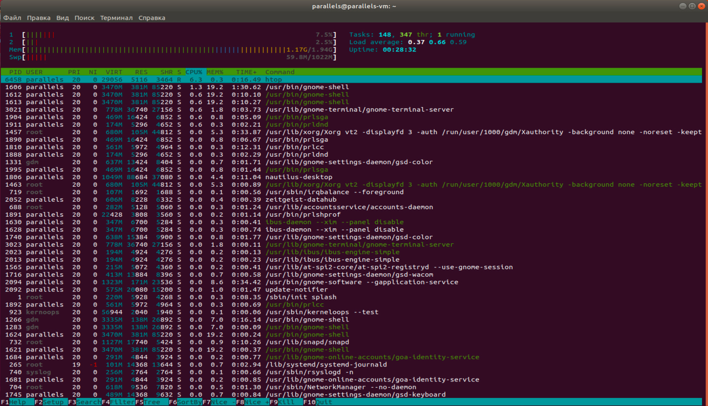
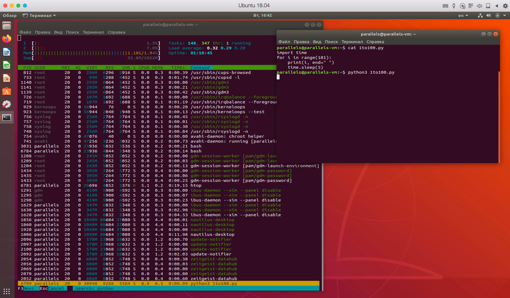

# Домашнее задание 5
**Задача 1** - Запустить htop и посмотреть, сколько процессоров и оперативной памяти есть на сервере.
```
sudo apt install htop
htop
```
  

**Задача 2** - Найти все программы с расширением .py.
```
find / *.py
```
**Задача 3** - Создать и запустить программу на Python, выводящую числа от 0 до 100 включительно.
Запустить htop во время выполнения программы и найти выполняемую программу в списке процессов, 
используя поиск по ключевому слову python (использовать средства поиска htop).  


