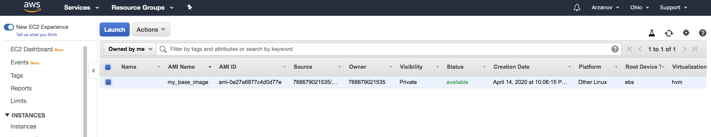

# Домашнее задание 6

**Задание 1** - Создать AMI на основе имеющегося у вас инстанса.

**Задание 2** - Создать новый инстанс на основе AMI, сделанного в предыдущем задании.
Проверить, присутствуют ли на новом инстансе программы, установленные на исходном инстансе.

**Задание 3** - Добавить новый диск к используемому инстансу. 
Проверить доступ к этому диску и создать на нем текстовый файл test.txt, содержащий слово test. 
Затем создать новый инстанс, отсоединить диск от старого и подсоединить к новому. 
Проверить наличие на диске файла test.txt и просмотреть его в текстовом редакторе nano.

**Добавляем том 5GB**

**Монтируем, форматируем и создаем файл test.txt**

**Присоединяем диск к новому инстансу, монтируем и убеждаемся, что файл на месте**

